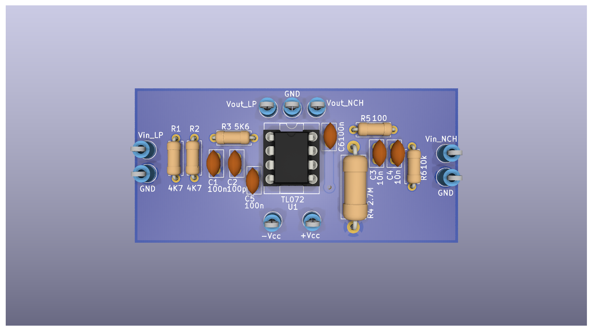
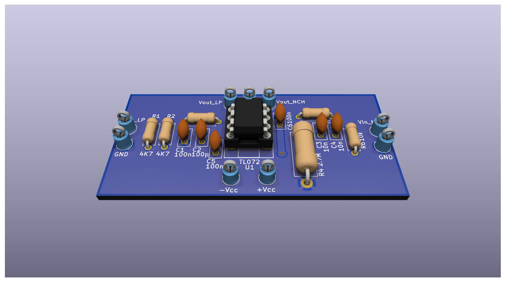
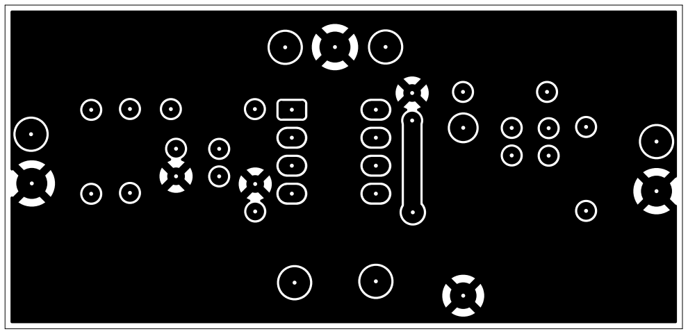
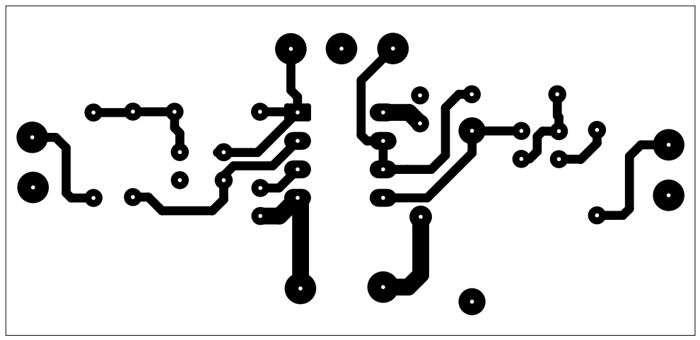
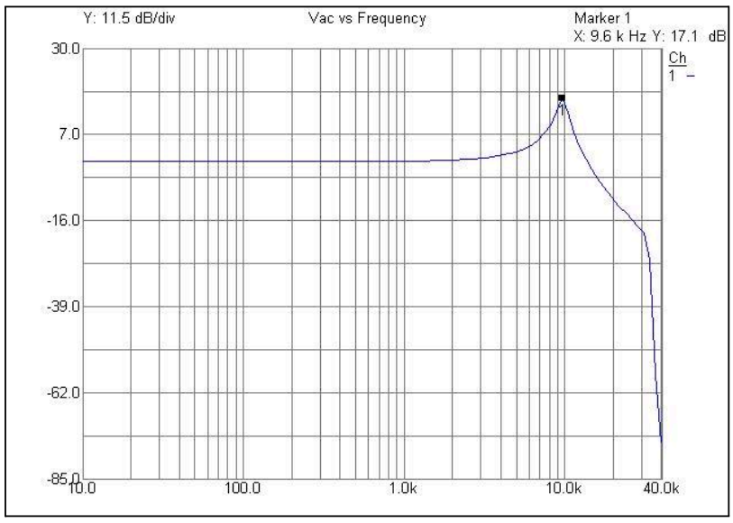
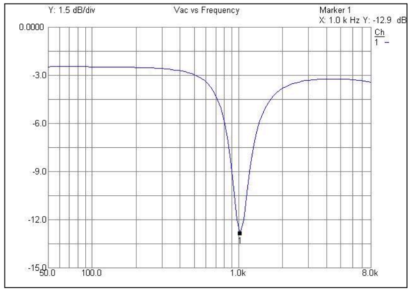

# Diseño de PCB: Filtro Analógico Activo (Low Pass & Notch) con TL072
Este proyecto consiste en el diseño y ruteo de una PCB para un Filtro Analógico Activo del tipo Pasa Bajos y Notch utilizando el Amplificador Operacional TL072. El objetivo principal fue realizar el análisis de respuesta en frecuencia empleando un Analizador de Redes.    

## Vistas del Proyecto

  
  

## Criterios de Diseño Aplicados

Durante el ruteo de la placa, los criterios de diseño que se tomaron para garantizar la estabilidad del circuito fueron:

* **Desacople de Alimentación Vcc:** Ubicación de capacitores cerámicos de 100nF en los pines de +Vcc y -Vcc para mitigar los efectos del ruido de alta frecuencia en la entrada de la alimentación del Op. Amp.
* **Plano GND en la Top Layer:** Implementación de un plano de masa continuo (*GND Pour*) en la capa Top para blindar el circuito y reducir significativamente las corrientes de retorno.

## Ruteo de Capas (Top & Bottom)

  
  

## Respuesta en frecuencia de cada filtro

  
  

