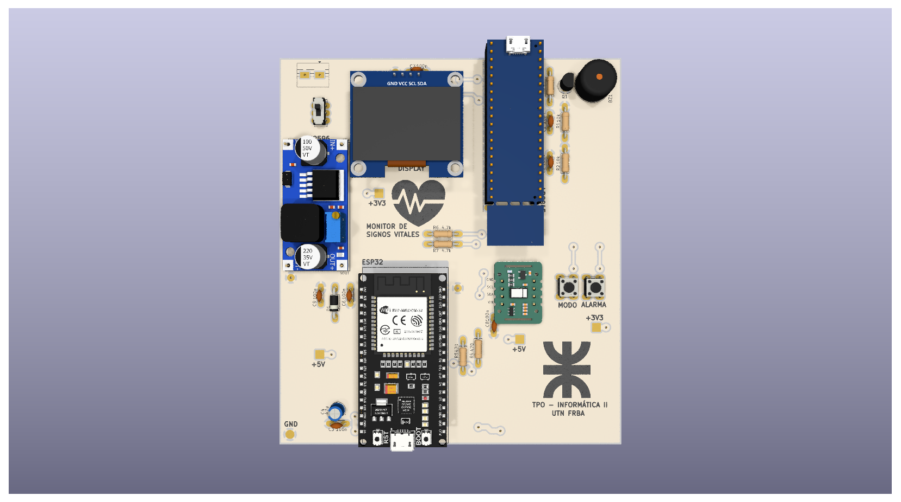
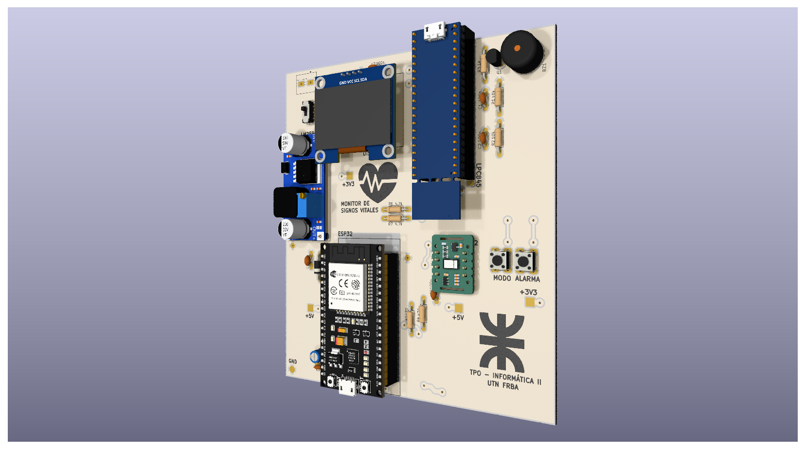
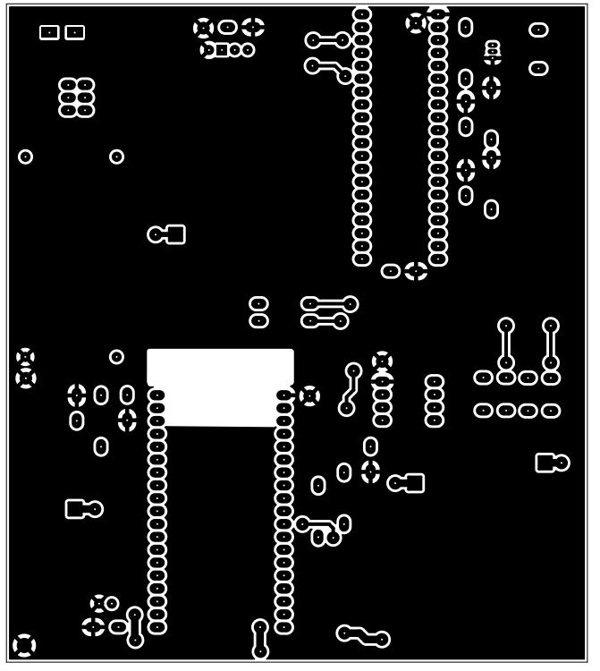
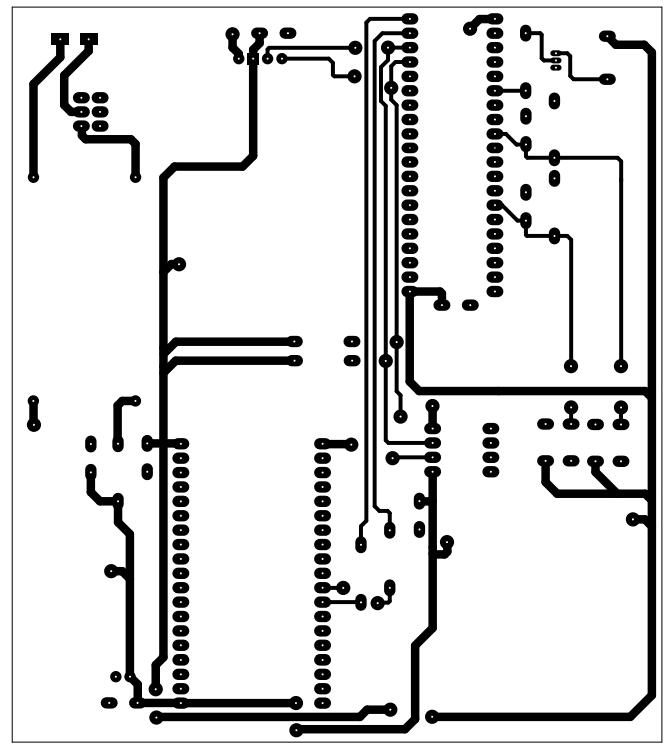

# Data Logger de Signos Vitales (LPC845 + ESP32)

## Descripción General
Este proyecto consiste en el desarrollo de un sistema embebido para la adquisición, registro y monitoreo de señales biomédicas. El sistema utiliza un microcontrolador **ARM Cortex-M0+ (LPC845)** para el procesamiento de señales y un módulo **ESP** para la transmisión de datos, integrando lógicas de 3.3V y protecciones de hardware.

## Especificaciones Técnicas y Criterios de Diseño
Para garantizar la integridad de las señales analógicas y la estabilidad del sistema, se aplicaron los siguientes criterios durante el diseño en **KiCad**:

* **Integridad de Señal:** Implementación de capacitores de desacople de 100nF en los pines de alimentación de cada dispositivo para filtrar ruido de alta frecuencia.
* **Gestión de Retornos:** Diseño de un plano de masa (*GND Pour*) continuo en la capa superior (*Top Layer*) para blindaje electromagnético y minimización de corrientes de retorno.
* **Compatibilidad de Lógica:** Manejo de niveles lógicos de 3.3V y diseño de protecciones de hardware para preservar la integridad de los microcontroladores.

## Documentación y Fabricación
* **Paquete Gerber:** Generación de archivos vectoriales para la fabricación de la placa (Cobre, Máscara y Serigrafía).
* **Bill of Materials (BOM):** Lista de materiales detalladas para los componentes.
* **Composición 3D:** Modelado y visualización final de la placa mediante archivos .step.

## Vistas del Proyecto

  
  

## Ruteo de Capas (Top & Bottom)

  
  

---
